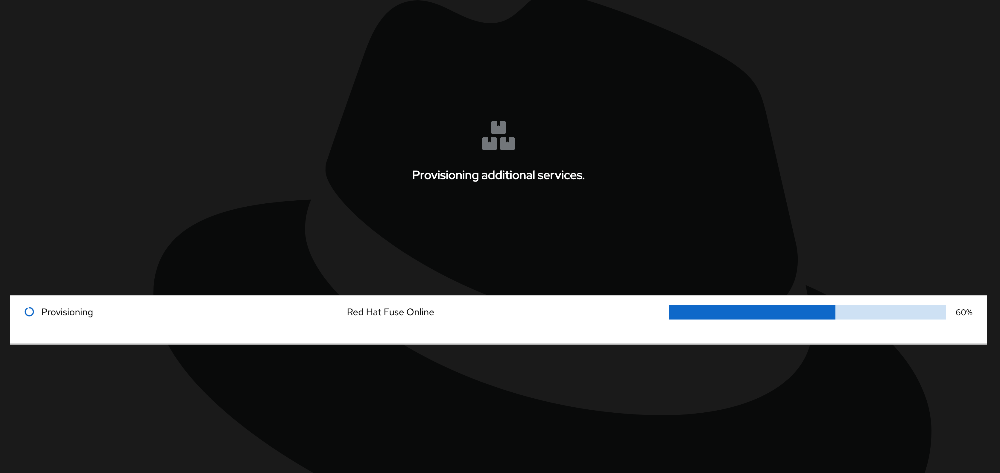
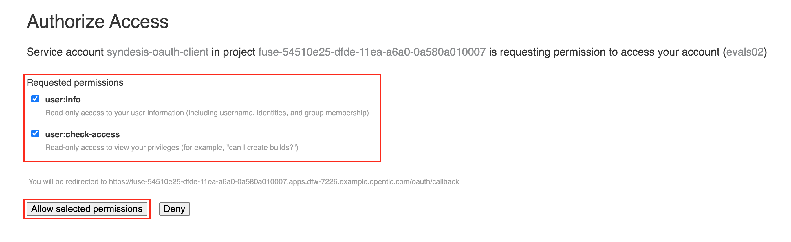

# Getting Started

1. Login to the Solution Explorer. Use your assigned username in the format as below and the password as shown below. Replace ```XX``` with the student number assigned to you.

```
Username: evalsXX
Password: peTG3NvNzcTK1bi
```


2. Click Get Started Link in the ```Low Code API Development and SaaS Integration``` box.  


3. The Fuse Online and 3Scale environment for the labs will now be provisioned. You should see a progress bar of it as shown in the screen below. Wait till it completes.



4. Close the browser tab.

5. Open [Fuse Online console][2] by opening the link. It should automatically log you in usnig Red Hat SSO and take you to the screen as below asking you to authorize access to OpenShift artificats in your project. Check all ```Requested Permissions```. Click ```Allow Selected Permissions``` to grant permissions.



<p align="center">
  <a href="/README.md">Previous Exercise</a> &nbsp;|
  &nbsp;<a href="/README.md">Table of Contents</a> &nbsp;|
  &nbsp;<a href="/02%20-%20Get%20Started.MD">Next Exercise</a>
</p>

[1]: https://tutorial-web-app-webapp.apps.dfw-7226.example.opentlc.com/
[2]: https://fuse-2dd27faf-dfda-11ea-a6a0-0a580a010007.apps.dfw-7226.example.opentlc.com/
