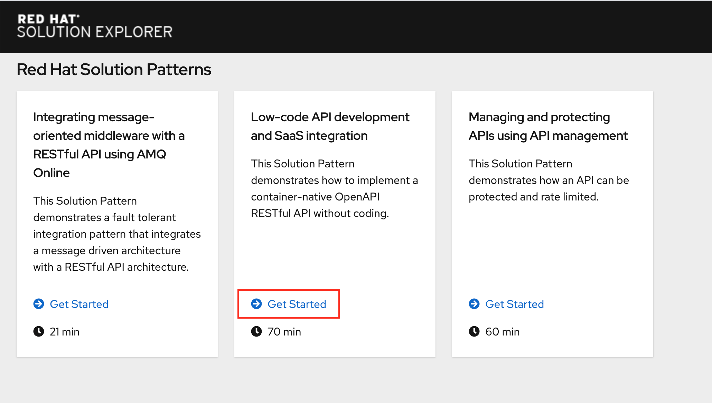

# Getting Started

1. Login to the Solution Explorer. Use your assigned username in the format as below and the password as shown below. Replace XX with the student number assigned to you.

```
Username: evalsXX
Password: peTG3NvNzcTK1bi
```


2. Click Get Started Link in the ```Low Code API Development and SaaS Integration``` box.  


