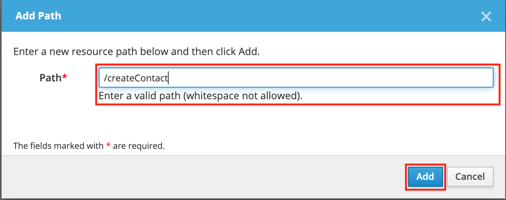
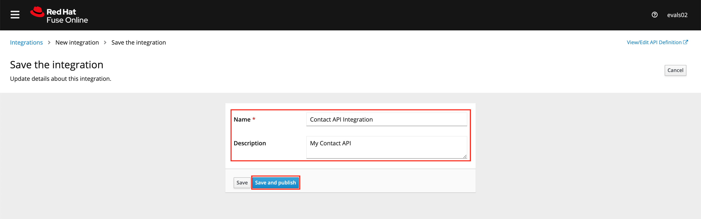

# Creating an API Integration in Fuse Online  

## Creating an Integration with API details  

In this procedure, you create an integration with an API and include a data type. A Data Type represents a data structure that can be passed to your API and can then be used as parameters in your API definition and within the Fuse Online Integration Flow Editor to transform and map data as part of an Integration.

1. Log in to the Red Hat [Fuse Online Console][2] if you are already not. Ensure you use your username assinged to you.
```
Username: evalsXX
Password: peTG3NvNzcTK1bi
```

2. Choose ```Connections``` link from the left navigation  menu to create a new Database connection.


3. Choose ```PostgresDB``` database connection to set the DB values. Note that this is already populated with the values. 
   - Leave the default values. Do not change.  
   - Rename the connection object by clicking on the ```Pencil``` icon.  
   - Click ```Edit``` button to validate the connection details.  

   It should say ```Database has been successfully validated.```


4. Choose Integrations from the left navigation menu. Click the Create Integration button to start the New Integration wizard.


5. Choose **API Provider** on the subsequent Choose a Start Connection screen.


6. When prompted choose **Create** and click **Next** to navigate to the API Designer.


7. Rename your API and description from "Untitled API" to as below. Remember to replace XX with ID assigned to you for this lab.
```
APIName : Contact-API-XX
Description: My Contact API
```


8. Click Add a data type under the Data Types heading on the left of the API Designer screen.


9. In the Enter Basic Information section enter the following in the Name field:

```
Name: Contact
```
Enter the following JSON in the Enter JSON Example field:

```
{"firstName": "John", "lastName": "Doe", "companyName": "Red Hat"}
```


10. Scroll down and click Format and Save.

11. Check your workCheck your work. Is ```</>Contact``` listed under the Data Types on the API Designer screen?


## Creating a POST Resource Path

A Path represents an API endpoint/operation and the associated parameters required to invoke it.

1. Click Add a path under the Paths heading on the left of the API Designer screen.  


2. In the window that appears, enter the following in the Path field. Click Add to confirm your entry.
```
/createContact
```



3. Click your new ```/createContact``` endpoint under the Paths heading.

4. Click ```Add Operation``` under the ```POST``` icon in the Operations section on the right.


5. Enter the following in the Summary field:

```
Summary field: createContact
Operation ID field: createContact
```


6. In the Request Body section, click Add a request body. Choose ```Contact``` as the type.

7. In the Responses section click Add a response.

8. In the window that appears choose 200 OK as the option.
    - Click Add.
    - Click No description beside the 200 OK response and enter the following in the Description field: ```Create contact response```

9. Choose ```String``` as the type. Fuse Online automatically completes the type ```String``` as ```String```.


## Creating a GET Resource Path

1. Just like above,  create additional path to list contacts. Click Add a path under the Paths heading on the left of the API Designer screen.  


2. In the window that appears, enter the following in the Path field. Click Add to confirm your entry.
```
/listContacts
```


3. Click your new ```/listContacts``` endpoint under the Paths heading.

4. Click ```Add Operation``` under the ```GET``` icon in the Operations section on the right.


5. Enter the following in the Summary field:

```
Summary field: listContacts
Operation ID field: listContacts
```


6. In the Responses section click Add a response.

7. In the window that appears choose 200 OK as the option.
    - Click Add.
    - Click No description beside the 200 OK response and enter the following in the Description field: ```Create contact response```

8. Choose ```Array``` as the type. Fuse Online automatically completes the type ```Contact``` as ```String```.


## Save the API specification

10. Click Save in the top right corner of the page to save your work. The New Integration wizard is displayed.

11. Click Next. You should now see the operations in the Contact API as below.


## Save and Publish the integration.

1. Click Publish on the New Integration wizard screen. 

2. When prompted to Give this integration a name. Remember to replace XX below with the user ID assigned at the beginning of this lab.

    - Enter the following in the Integration Name field:
      ```
      Contact-API-Integration-XX
      ```
    - Enter the following in the Description field:
      ```
      Contact-API-Integration-XX
      ```

3. Click Save and Publish to save your API design.



## Check your workCheck your work
Is a Greeting Integration entry listed in the Fuse Online Home screen?


___
<p align="center">
  <a href="/02%20-%20Get%20Started.MD">Previous Exercise</a> &nbsp;|
  &nbsp;<a href="/README.md">Table of Contents</a> &nbsp;|
  &nbsp;<a href="/04%20-%20Implement%20Operations.MD">Next Exercise</a>
</p>
 
[1]: https://tutorial-web-app-webapp.apps.dfw-7226.example.opentlc.com/
[2]: https://fuse-2dd27faf-dfda-11ea-a6a0-0a580a010007.apps.dfw-7226.example.opentlc.com/
[3]: https://3scale-admin.apps.dfw-7226.example.opentlc.com/
