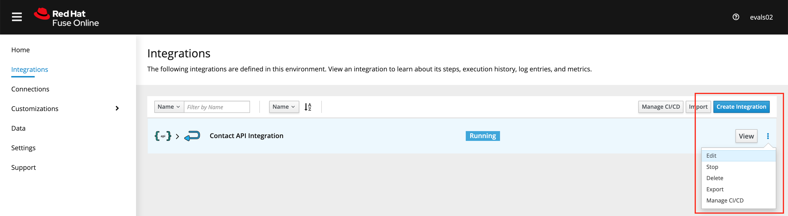
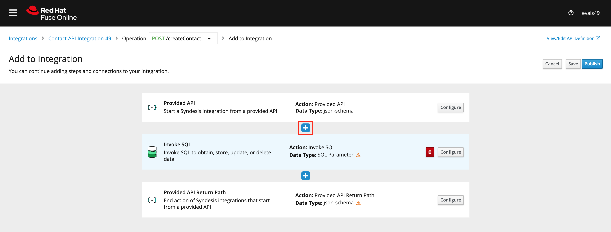
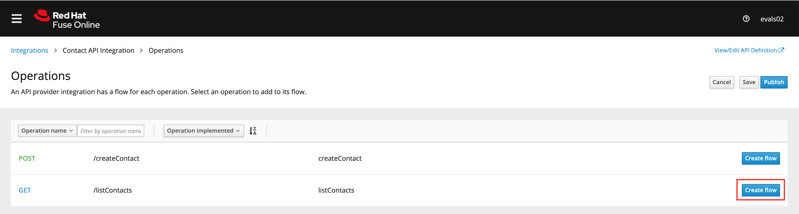
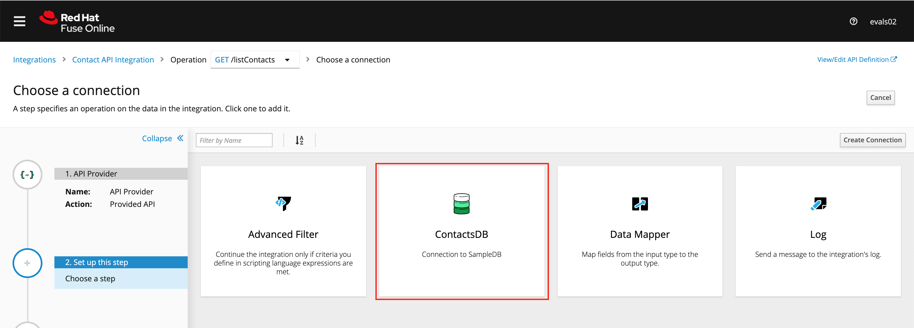
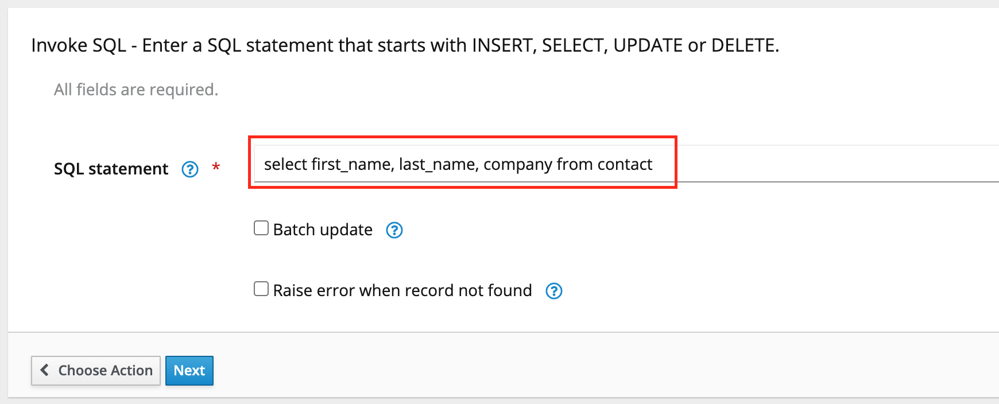
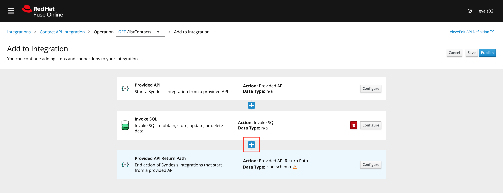
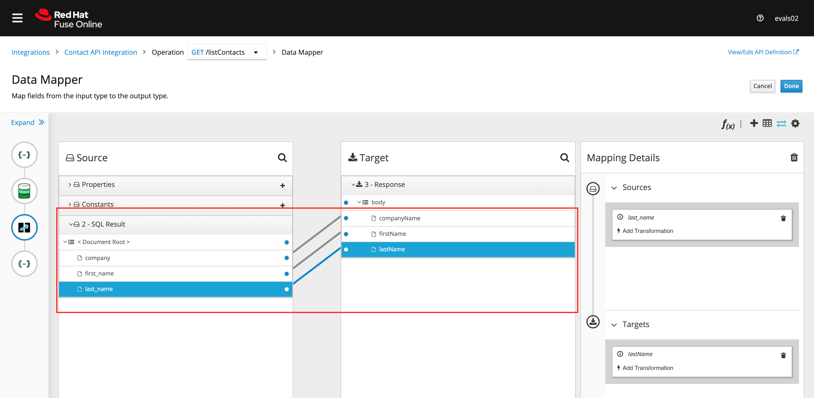

# Implementing and publishing the API in Fuse Online  

#  Implementing the API Operations  

## Implement createContact operation

1. Log in to the Red Hat [Fuse Online Console][2] if you are already not. Ensure you use your username assinged to you.
```
Username: evalsXX
Password: peTG3NvNzcTK1bi
```
2. Select Integrations from the left hand menu and edit the Contact API Integration.



3. Click on ```Create Flow``` button to implement the ```/createContact``` operation.


4. Click on ```+``` button to **Add a Step** to the flow. Choose **ContactsDB** created earlier in the lab.


5. Choose **Invoke SQL** by clicking the ```Select``` button. 


6.  Set the SQL statement as below and click ```Next```
```
insert into contact(first_name, last_name, company) values(:#firstName, :#lastName, :#Company)
```


7. Click on ```+``` button to **Add a Step** to the flow. Choose **Data Mapper**.



8. Map the data elements from the request to the ```Invoke SQL``` step. Click ```Done``` when mapping is completed as shown below.


9. Map data to the final response. Click ```+``` to add a ```Data Mapper``` step. Click ```Done``` when mapping is completed as shown below.


10. Save the flow to the Contact API Integration.

## Implement listContacts operation

1.  Click on ```Create Flow``` button to implement the ```/listContacts``` operation.



2.  Click on ```+``` button to **Add a Step** to the flow. Choose **ContactsDB** created earlier in the lab.



3. Choose **Invoke SQL** by clicking the ```Select``` button. 


4. Enter the SQL select statement as below into the dialog screen and click ```Next``` to return to integration flow.

```
select first_name, last_name, company from contact
```



5. Click on ```+``` button to **Add a Step** to the flow after the Database step. Choose **Data Mapper**.



6. Add mapping to the response as below. Click ```Done``` when completed.



7. Click ```Publish``` to save the integration and publish to runtime.

<p align="center">
  <a href="/03%20-%20Creating%20API%20in%20Fuse%20Online.MD">Previous Exercise</a> &nbsp;|
  &nbsp;<a href="/README.md">Table of Contents</a> &nbsp;|
  &nbsp;<a href="/02%20-%20Get%20Started.MD">Next Exercise</a>
</p>

[1]: https://tutorial-web-app-webapp.apps.dfw-7226.example.opentlc.com/
[2]: https://fuse-2dd27faf-dfda-11ea-a6a0-0a580a010007.apps.dfw-7226.example.opentlc.com/
