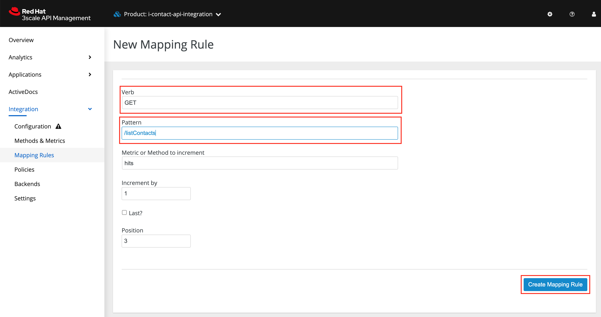
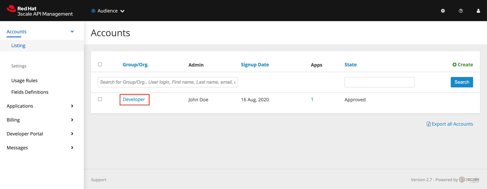
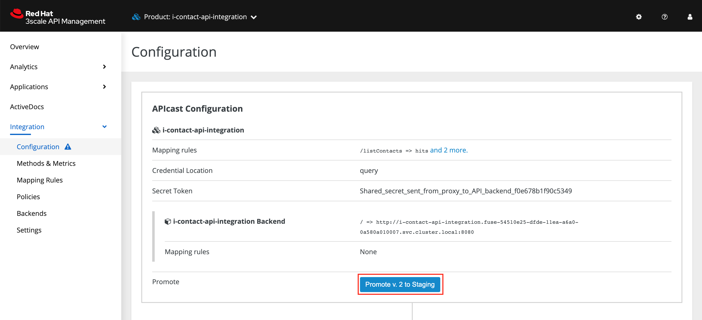

# Exposing and invoking the API
___
## API Management Login

1. Open the [Red Hat 3scale API Management Platform][3]: Login screen. Select the Red Hat Single Sign On option. This triggers an OAuth Flow and redirects you back to the Red Hat 3scale API Management Platform Dashboard.


Dismiss the How does 3Scale work? option which is displayed the first time you log in to Red Hat 3scale API Management Platform. The main Dashboard is displayed.


Check your workCheck your work
Can you see the Red Hat 3scale API Management Platform Dashboard and navigate the main menu?

___
## Adding the App Endpoint to Red Hat 3scale

1. From the APIs section of the Dashboard, select the New Product item.


2. Select the Import from OpenShift option. If this option is not enabled, click ```Authenticate to enable this option```.


3. In the next screen click on Allow Selected Permissions.


4. Choose the fuse option from the Namespace list. Choose i-greeting-api from the Name list. Click Create Product.


___
:information_source: This process can take a few minutes.
___

## Edit the API:

1. Choose Product: i-greeting-api from the top navigation menu to view the ```Overview``` page.


2. Select the ```Settings``` item in the ```Integration``` dropdown menu. In the Staging Public Base URL, enter the URL below and click ```Update Product``` at the bottom of the page. Remember to replace XX with your assigned ID.

```
https://wt3-evalsXX-3scale.apps.dfw-7226.example.opentlc.com
```


3. Create a mapping rule for the /createContact endpoint. Select the Mapping Rules item in the Integration dropdown menu. Click Add Mapping Rule


4.Select ```POST``` in the Verb field. Enter ```/createContact``` in the Pattern field.


Click Create Mapping Rule at the bottom of the page

5. Similarly add a Mapping rule for ```/listContacts``` ```GET``` method. Select ```GET``` in the Verb field. Enter ```/listContacts``` in the Pattern field.



Click Create Mapping Rule at the bottom of the page


6. Check your workCheck your work
Is the new mapping rule visible from the Mapping Rules screen?

___
## Configuring your API

### Create a new Application Plan:

1. Select Applications > Application Plans from the side navigation. Click ```Create Application Plan```.


2. Enter the following for Name and System name. Leave the other fields with their default values. Remember to replace XX with your user ID assined at the beginning of this lab.

  ```
  Contact-API-XX
  ```
  
  
  Select Create Application Plan. You will be redirected to the Application Plans screen.

3. Click Publish, beside your plan list item, to publish the Plan.


4. Create a new Application for the Developer Group, assigned to the Plan.  Select Audience from the top navigation menu.


5. Select the Developer Account to open the Account Summary page.



6. Select the (num) Application item from the breadcrumb to view Applications.


7. Select the Create Application button in the top right.


8. Select the ```Contact-API-XX``` Plan in the Application plan menu. Enter the following for Name and Description and select ```Create Application```. Remember to replace XX with the user ID assigned to you at the beginning of this lab.

```
Contact-API-XX
```


10. Set a custom User Key for the application:


16. On the low-code application screen you were redirected to, scroll to the API Credentials section. Click the green pencil icon beside the User Key. In the Set Custom User Key modal dialog, enter the value below and select ```Set Custom Key```.

```
test
```


___
## Check your workCheck your work
Review the settings in 3scale. Do they match the settings outlined in this task?
___

## Staging your API

1. Click the Configuration menu item in the Integration dropdown menu from the side navigation.

2. In the APIcast Configuration section, click the Promote to Staging button.



___
## Check your workCheck your work
Is a new version of the API visible in the Environments section of the page?
___
## Check your workCheck your work
___
## Invoking the /listContacts API
___

1. Use an HTTP client to invoke the route, /listContacts for example:

```
curl -d '{"name":"John"}' -H "Content-Type: application/json" -X GET "https://wt3-evals02-3scale.apps.dfw-7226.example.opentlc.com:443/listContacts?user_key=test"
```

Did you receive contact list?

___
## Invoking the /createContact API
___
1. Use an HTTP client to invoke the route, /createContact for example:

```
curl -d '{"companyName": "Red Hat", "firstName": "Banu","lastName": "B"}' -H "Content-Type: application/json" -X POST "https://wt3-evals02-3scale.apps.dfw-7226.example.opentlc.com:443/createContact?user_key=test"
```

2. Check if the ```/listContacts``` method retrieves the data used in ```/createContact``` test.

___
## Track and monitor API Usage.
___


___
## Congratulations you have completed this lab!

___
<p align="center">
  <a href="/04%20-%20Implement%20Operations.MD">Previous Exercise</a> &nbsp;|
  &nbsp;<a href="/README.md">Table of Contents</a> &nbsp;|
  &nbsp;<a href="/06%20-%20Workshop%20Links.MD">Workshop Links</a> &nbsp;
</p>

[1]: https://tutorial-web-app-webapp.apps.dfw-7226.example.opentlc.com/
[2]: https://fuse-2dd27faf-dfda-11ea-a6a0-0a580a010007.apps.dfw-7226.example.opentlc.com/
[3]: https://3scale-admin.apps.dfw-7226.example.opentlc.com/
